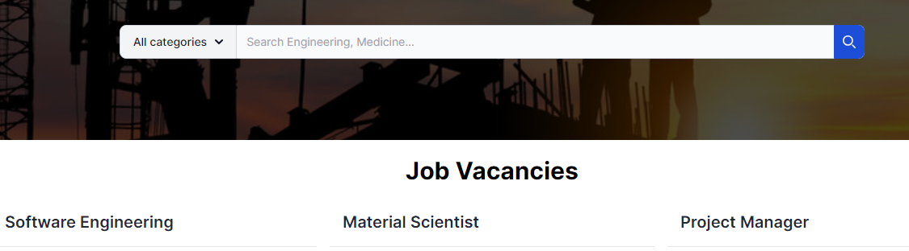
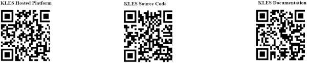

<!-- Table of contents -->
## Table of Contents

#### 1. Introduction and Project Overview
  - 1.1. Objectives  
  - 1.2. Stakeholders  
  - 1.3. Development Process  
    - 1.3.1. Requirements Gathering  
    - 1.3.2. System Design  
    - 1.3.3. Implementation  
    - 1.3.4. Integration and Testing  
    - 1.3.5. Deployment  
  - 1.4. Methodology  
    - 1.4.1. Justification for Using the Waterfall Model  
  - 1.5. System Modules  
  - 1.6. Tools and Technologies  
  - 1.7. Models (Tables) in Prisma Schema  

#### 2. System Design and Implementation
  - 2.1. High-Level Architecture Diagram  
  - 2.2. Components Description  
    - 2.2.1. Client Side (Frontend)  
    - 2.2.2. API Used for Communications between the Frontend and Backend  
    - 2.2.3. Server Side (Backend)  
    - 2.2.4. Database  
  - 2.3. Components Interaction  
  - 2.4. Database Schema and Model (Prisma) Documentation  
    - Datasource and Generator  
    - Models  
    - Relationships  

#### 3. Results and Outcomes
  - 3.1. Development Phase Outcomes  
    - 3.1.1. Requirements Gathering  
    - 3.1.2. System Design  
    - 3.1.3. Implementation  
    - 3.1.4. Integration and Testing  
    - 3.1.5. Deployment  
  - 3.2. Detailed Process Flow  
    - 3.2.1. Job Request Initiation by Foreign Company  
    - 3.2.2. Review and Verification by Foreign Government  
    - 3.2.3. Pooled Submission to Kenyan Government  
    - 3.2.4. Review and Approval by Kenyan Government  
    - 3.2.5. Job Availability for Kenyan Workers  
    - 3.2.6. Job Application by Kenyan Workers  
    - 3.2.7. Screening and Selection by Kenyan Government  
    - 3.2.8. Notification to Kenyan Workers  
    - 3.2.9. Export Process  
  - 3.3. Additional Functionalities  
    - Job Request and Application Management  

#### 4. Challenges Encountered During Development

#### 5. Conclusion

#### 6. References

#### 7. QR Codes For Resources


<br/>
<br/>


  ## 1. Introduction and Project Overview
The **Kenyan Labor Export System (KLES)** is designed to streamline the labor export process for Kenyan workers. It aims to facilitate job matching, ensure data security, and protect worker rights by providing a comprehensive platform for managing labor requests and applications.

 ### 1.1. Objectives
- **Improve Labor Export Processes**: Enhance efficiency and transparency in the labor export system.
- **Ensure Data Security**: Protect sensitive information through robust security measures.
- **Protect Worker Rights**: Safeguard the rights and well-being of Kenyan workers through regulatory compliance and support mechanisms.

 ### 1.2. Stakeholders
- **Kenyan Workers**: Individuals seeking employment opportunities abroad.
- **Kenyan Government**: Regulatory body overseeing labor export processes and worker protection.
- **Foreign Governments**: Authorities in destination countries managing labor requests from local companies.
- **Foreign Companies**: Employers in destination countries seeking to hire Kenyan workers.

 ### 1.3. Development Process
The development process for KLES was methodical and structured, ensuring each phase was completed thoroughly before moving on to the next. Below is an overview of the development stages:

 #### 1.3.1. Requirements Gathering
- **Objective**: To understand and document all functional and non-functional requirements of the system.
- **Activities**: 
  - Defining system requirements and specifications.

#### 1.3.2. System Design
- **Objective**: To design the system architecture, database schema, and user interface layout.
- **Activities**:
  - Creating high-level architecture diagrams.
  - Designing the database schema using tools like Eraser.IO.
  - Developing wireframes and mockups for the user interface.

#### 1.3.3. Implementation
- **Objective**: To develop each module as per the design specifications.
- **Activities**:
  - Writing code for frontend and backend functionalities using Next.js.
  - Implementing the database schema with Prisma ORM.
  - Setting up authentication and authorization using NextAuth.
  - Developing specific modules such as Registration and Authentication, Job Request/Posting and Approval, User Application, Application Status Tracking, and Feedback and Grievance Reporting.

#### 1.3.4. Integration and Testing
- **Objective**: To integrate all modules and perform comprehensive testing.
- **Activities**:
  - Integrating frontend and backend components.
  - Conducting unit testing, integration testing, and system testing.
  - Debugging and fixing any issues identified during testing.

#### 1.3.5. Deployment
- **Objective**: To deploy the system to the production environment.
- **Activities**:
  - Preparing the production environment on Vercel.
  - Deploying the application.


### 1.4. Methodology
The development of the Kenyan Labor Export System (KLES) followed the **Waterfall model**. This linear and sequential approach allowed for systematic completion of each module before progressing to the next, ensuring thorough development and testing at each stage.

#### 1.4.1. Justification for Using the Waterfall Model
- **Sequential Development**: The Waterfall model's step-by-step process aligns well with the approach of completing each module in sequence.
- **Clear Milestones**: Each phase has defined milestones and deliverables, making it easier to track progress and ensure completeness.


### 1.5. System Modules
1. **Requirements Gathering**: Understanding and documenting all project requirements.
2. **System Design**: Designing the system architecture, database schema, and user interface layout.
3. **Implementation**: Developing each module, such as:
   - **Registration and Authentication**: For users to register and authenticate.
   - **Job Request/Posting and Approval**: For job postings to be reviewed and approved.
   - **User Application**: For users to apply and be screening process.
   - **Application Status Tracking**: For tracking the status of job applications.
   - **Feedback and Grievance Reporting**: For reporting feedback and grievances.
4. **Integration and Testing**: Integrating all modules and performing comprehensive testing to ensure seamless operation.
5. **Deployment**: Deploying the system to the production environment (vercel).


### 1.6. Tools and Technologies
The following tools and technologies were used in the development of KLES:
1. **Next.js**: For both frontend and backend functionality.
2. **Prisma**: Used as the ORM (Object-Relational Mapping).
3. **Supabase**: For the database.
4. **NextAuth**: For authentication and authorization.
5. **VS Code**: As the primary code editor.
6. **Git**: For version control.
7. **GitHub**: For repository hosting and collaboration.
8. **YouTube**: For learning and understanding new concepts through tutorials.
9. **Eraser**: For creating the database schema diagram.
10. **AI**: For error debugging and troubleshooting.

### 1.7. Models (Tables) in Prisma Schema
- **Citizen**
- **Application**
- **Contract**
- **kles**
- **Job**
- **Company**
- **Agency**
- **Messages/Feedback**: From Kenyan citizens to the Kenyan government.
- **Updates**:
  - **KLESUpdate**: Updates sent by KLES.
  - **AgencyUpdate**: Updates sent by agencies (foreign government representatives).


<br/>


## 2. System Design and Implementation
<br/>

### 2.1 High-Level Architecture Diagram
<br/>


### 2.2 Components Description

#### 2.2.1 Client Side (Frontend)
The frontend of the KLES is built using the Next.js framework with React. It is responsible for the user interface and user experience. Key features include:
- **Authentication**: Handles user login and registration using NextAuth.
- **User Interfaces for Different Roles**: Provides distinct interfaces for Kenyan workers, Kenyan Government officials, foreign government officials, and foreign companies.
- **Responsive Design**: Ensures usability across various devices.


#### 2.2.2 API Used for Communications between the Frontend and Backend
The API routes in the Next.js framework handle communication between the frontend and backend. These routes provide endpoints for various functionalities such as user authentication, job posting, application matching, and status tracking.


#### 2.2.3 Server Side (Backend)
The backend is also managed by Next.js, serving full-stack functionality. Key features include:
- **API Routes**: Next.js server actions expose the endpoints for frontend interaction.
- **Authentication & Authorization**: Managed by NextAuth for secure user sessions and permissions.
- **Business Logic**: Implements core functionalities, such as job posting, approval workflows, and application matching.

#### 2.2.4 Database
The database is managed using Supabase with Prisma as the ORM. Key aspects include:
- **Schemas**: Defines the structure for users, job postings, applications, and other entities.
- **Data Integrity**: Ensures consistent and reliable data storage and retrieval.
- **Scalability**: Designed to handle growing amounts of data and users.


### 2.3 Components Interaction
- **Frontend-Backend Communication**: Utilizes Next.js API routes for interaction between frontend and backend.
- **Backend-Database Interaction**: Prisma ORM facilitates database operations with Supabase.


## 2.3 Database schema and model (Prisma) Documentation

### Datasource and Generator

```prisma
generator client {
  provider = "prisma-client-js"
}

datasource db {
  provider = "postgresql"
  url      = env("DATABASE_URL")
}

```

### Models

#### Citizen
Represents a citizen of Kenya who can apply for jobs.

```prisma
model Citizen {
  id              Int          @id @default(autoincrement())
  nationalID      String       @unique  
  fullName        String       
  address         String       
  phone           String        
  email           String       @unique  
  kra             String       @unique  
  password        String       
  applications    Application[]  
}
```

#### Agency
Represents an agency in a foreign country responsible for verifying and pooling job requests from companies in their country before submitting them to the Kenyan government.

```prisma
model Agency {
  id             Int        @id @default(autoincrement())
  country        String     @unique  
  iso            String     
  contractId     Int        @unique  
  contract       Contract   @relation(fields: [contractId], references: [id]) 
  password       String     
  companies      Company[] 
}
```
#### Kles
Represents an administrative user in the Kenyan Labor Export System (KLES).

```prisma
model Kles {
  id          Int        @id @default(autoincrement())
  department  String    
  email       String     @unique  
  password    String     
}
```

#### Company
Represents a company that submits job requests through an agency.

```prisma
model Company {
  id              Int        @id @default(autoincrement())
  companyName     String     @unique  
  country         String     
  companyAddress  String     
  companyEmail    String     @unique  
  companyWebsite  String     
  companyIndustry String     
  password        String     
  agencyId        Int        
  agency          Agency     @relation(fields: [agencyId], references: [id])  
  jobs            Job[]      
}

```

#### Job
Represents a job request submitted by a company. The status of the job indicates its current state in the workflow (e.g., submitted, verified, approved, rejected).

```prisma
model Job {
  id             Int          @id @default(autoincrement())
  title          String       
  description    String       
  qualification  String       
  slots          Int          
  status         String       @default("submitted")  
  companyId      Int          
  company        Company      @relation(fields: [companyId], references: [id]) 
  applications   Application[]  
}
```

#### Application
Represents an application made by a citizen for a job.

```prisma
model Application {
  id              Int          @id @default(autoincrement())
  citizenId       Int          
  citizen         Citizen      @relation(fields: [citizenId], references: [id])  
  jobId           Int          
  job             Job          @relation(fields: [jobId], references: [id])  
  abstractFile    String?      
  curriculumVitae String?      
  nationalID      String       
  @@unique([citizenId, nationalID])  
}
```

#### Contract
Represents a contract associated with an agency. This contracts special IDs of 8 characters that are assigned to a certaing country after an agreement with kenyan government .

```prisma
model Contract {
  id          Int       @id @default(autoincrement())
  contractID  String    @unique  
  agencies    Agency[]  
}
```

### Relationships

  - **Citizen-Application:**: One-to-Many Where a citizen can have multiple applications.
  - **Agency-Company:**: One-to-Many where an agency can have multiple companies.
  - **Company-Job:**: One-to-Many where a company can have multiple jobs.
  - **Job-Application:**: One-to-Many where a job can have multiple applications.
  - **Contract-Agency:**: One-to-Many where a contract can have multiple agencies..


<br/>

## 3. Results and Outcomes
<!-- # System Design and Internal Workings -->
### 3.1 Development Phase Outcomes

#### 3.1.1. Requirements Gathering
- **Deliverable**: Comprehensive Requirements Document
- **Key Results**:
  - Identified  core system requirements
  - Defined 4 user roles with specific access levels
  - Established data security protocols

#### 3.1.2. System Design
- **Deliverable**: System Architecture and Database Schema
- **Key Results**:
  - Created high-level architecture diagram
  - Designed database schema with 8 primary tables

#### 3.1.3. Implementation
- **Deliverable**: Functioning KLES Prototype
- **Key Results**:
  - Developed core modules (Registration, Job Posting, Application, All Stakeholders Interface)
  - Integrated NextAuth for secure authentication
  - Implemented Prisma ORM for efficient database operations

#### 3.1.4. Integration and Testing
- **Deliverable**: Fully Integrated and Tested System
- **Key Results**:
  - Performed integration testing across all modules
  - Resolved critical issues identified during testing

#### 3.1.5. Deployment
- **Deliverable**: Live KLES System
- **Key Results**:
  - Successfully deployed on Vercel platform

 <br/>

### 3.2 Detailed Process Flow
This documentation outlines the detailed internal workings of the system, including the roles and interactions of different users.

#### 3.2.1. Job Request Initiation by Foreign Company
**Role: Foreign Company**

Foreign companies are the initial users in the job request process. They are responsible for creating and submitting job requests, which include details such as job title, required skills, number of slots, job description, benefits, and salary range. When a foreign company submits a job request, its status is marked as `Submitted`.

**Foreign Company Interface: Job Request Page**

<!--  -->

In this interface, foreign companies can fill out the necessary details and submit the job request. The interface typically includes fields for job title, skills required, number of vacancies, detailed job description, and compensation package.

#### 3.2.2. Review and Verification by Foreign Government
**Role: Foreign Government (Agency)**

The foreign government, represented by an agency, receives job requests from various foreign companies within their country. The agency's role is to review these job requests and verify their authenticity and compliance with regulations. The agency can either verify or reject each job request. Verified requests are pooled together for submission to the Kenyan Government, while rejected requests are marked as `Rejected by Foreign Government`.

**Foreign Government Interface: Job Request Pool**


The interface for the foreign government allows them to see a list of all submitted job requests from their country's companies. They can review each request, verify its details, and decide whether to approve or reject it. Verified requests are then grouped together for a collective submission to the Kenyan Government.

#### 3.2.3. Pooled Submission to Kenyan Government
**Role: Foreign Government (Agency)**

After verifying the job requests, the foreign government agency submits the pooled requests to the Kenyan Government. This submission involves multiple job requests that have been verified and are now ready for approval by the Kenyan authorities. At this stage, the status of each job request changes to `Requested`.


#### 3.2.4. Review and Approval by Kenyan Government
**Role: Kenyan Government**

The Kenyan Government receives the pooled job requests from various foreign governments. Their responsibility is to review these requests, ensuring they meet the necessary standards and are beneficial for Kenyan workers. The Kenyan Government can either accept or reject each request. Accepted requests change their status to `Accepted` by Kenyan Government, while rejected requests are marked as `Denied` by Kenyan Government.

**Kenyan Government Interface: Job Request Review Page**

In this interface, Kenyan government officials can view and assess all incoming job requests from different countries. They can approve or deny each request based on criteria such as job quality, worker rights, and alignment with national labor policies.

#### 3.2.5. Job Availability for Kenyan Workers
**Role: Kenyan Citizen**

Once the Kenyan Government approves a job request, it becomes available to Kenyan workers. These job opportunities are displayed on the Kenyan citizen's job listings page, where workers can view and apply for them. Each worker can have up to two active applications at any given time. The status of these jobs is now `Available`.

**Kenyan Citizen Interface: Job Listings Page**


This page provides a list of all available job opportunities that have been approved by the Kenyan Government. Workers can search, filter, and apply for jobs based on their skills and interests. Each listing includes detailed information about the job, company, and benefits.

#### 3.2.6. Job Application by Kenyan Workers
**Role: Kenyan Citizen**

Kenyan workers can apply for jobs listed on the platform. They need to fill out an application form and submit necessary documents, such as resumes and certificates. Each worker can maintain up to two active applications simultaneously. The status of these applications is marked as `Application Submitted`.

**Kenyan Citizen Interface: Job Application Page**

In this interface, workers can complete their job applications by providing personal details, uploading required documents, and submitting their application for review. The system ensures that each worker can only apply for two jobs at a time to manage the application process efficiently.

#### 3.2.7. Screening and Selection by Kenyan Government
**Role: Kenyan Government**

The Kenyan Government reviews the applications submitted by Kenyan workers. This involves screening candidates, conducting interviews, and making final selections. The government can accept or reject applications based on their suitability for the job. If an application is accepted, its status changes to `Application Accepted`, and if rejected, it becomes `Application Rejected`.

**Kenyan Government Interface: Application Review Page**

This interface allows government officials to evaluate applications, conduct interviews, and make decisions on whether to accept or reject candidates. It provides tools for detailed screening and communication with applicants.

#### 3.2.8. Notification to Kenyan Workers
**Role: Kenyan Citizen**

Kenyan workers are notified about the status of their job applications through their profile page. They can check for updates on whether their applications have been accepted or rejected. The system also sends automatic notifications to ensure workers are informed in a timely manner.

**Kenyan Citizen Interface: Profile Page**

The profile page displays the current status of all applications submitted by the worker. It includes notifications about acceptance, rejection, or any additional steps required.

#### 3.2.9. Export Process
**Role: Kenyan Government and Kenyan Citizen**

For applications that are accepted, the Kenyan Government facilitates the export process. This involves completing necessary documentation and making arrangements for the worker's relocation to the foreign country. The status of these applications is marked as `Exported`.

**Kenyan Citizen Interface: Export Documentation Page**

This interface helps workers and government officials manage the export process, including document submission, travel arrangements, and compliance with legal requirements.

## Additional Functionalities

### Job Request and Application Management
- **Open/Close Requests:** Both agencies and Kenyan citizens can open or close job requests and applications.
- **Updates:** Agencies and Kenyan Government can send updates to their respective users (Kenyan workers or foreign companies).

**Interface: Job Request and Application Management Page**

This page provides tools for managing job requests and applications, allowing users to open or close requests and send updates. It ensures smooth communication and workflow management across all user roles.

<br/>

## 4. Challenges Encountered During  Development

Developing the Kenyan Labor Export System (KLES) presented several challenges:

1. **Learning New Technologies**:
    - At times, I had to work with new technologies that I was unfamiliar with. This required gathering resources and enduring a tough learning curve to master them.

2. **Debugging Complex Errors**:
    - I frequently encountered errors that were difficult to diagnose and fix. Some of these issues took a long time to resolve and resulted in sleepless nights.

3. **Limited Information on Manual Labor Export Processes**:
    - Having less information about how the full process of labor exports functions manually led to many inferences and assumptions. These assumptions and inferences were not fully justified.

Despite these challenges, the experience was invaluable and contributed significantly to my growth as a developer.


<!-- ## Conclusion
The Kenyan Labor Export System (KLES) provides a comprehensive solution for managing labor export from Kenya. It ensures a transparent and efficient process involving multiple stakeholders, from job requests by foreign companies to the final selection and export of Kenyan workers. The system's detailed statuses and clear interfaces for each user role ensure a streamlined and secure workflow. -->

### Conclusion

The Kenyan Labor Export System (KLES) provides a comprehensive solution for managing labor export from Kenya. It ensures a transparent and efficient process involving multiple stakeholders, from job requests by foreign companies to the final selection and export of Kenyan workers. The system's detailed statuses and clear interfaces for each user role ensure a streamlined and secure workflow.

KLES incorporates robust features to handle the complexities of labor export, such as detailed job request handling, applicant screening, and secure data management. By facilitating clear communication between the Kenyan government, foreign governments, companies, and Kenyan workers, KLES promotes a structured approach to labor export.

Moreover, KLES addresses critical aspects such as labor rights protection and worker well-being, ensuring that exported workers are well-prepared and supported throughout the process. The system's comprehensive modules for registration, job posting, application tracking, and feedback reporting make it a versatile tool that can adapt to various labor export scenarios.

# References

1. **Websites and Online Resources**:
    - Next.js. (n.d.). Documentation. Vercel. [https://nextjs.org/docs](https://nextjs.org/docs)
    - Prisma. (n.d.). Prisma documentation. [https://www.prisma.io/docs](https://www.prisma.io/docs)
    - React. (n.d.). React documentation. [https://react.dev/](https://react.dev/)
    - NextAuth.js. (n.d.). NextAuth.js documentation. [https://next-auth.js.org/](https://next-auth.js.org/)
    - Supabase. (n.d.). Supabase documentation. [https://supabase.com/docs](https://supabase.com/docs)
    - PostgreSQL. (n.d.). PostgreSQL documentation. [https://www.postgresql.org/docs/](https://www.postgresql.org/docs/)
    - Eraser.io. (n.d.). Eraser.io documentation. [https://docs.eraser.io/](https://docs.eraser.io/)

2. **Articles and Tutorials**:
    - Fadali, Y. (2023, May 30). How to create a full-stack application with Next.js – A step-by-step tutorial for beginners. freeCodeCamp. [https://www.freecodecamp.org/news/build-a-full-stack-application-with-nextjs/](https://www.freecodecamp.org/news/build-a-full-stack-application-with-nextjs/)
    - Olajide, J. (2023, March 11). Build a REST API with Prisma, Node JS and Typescript. DEV Community. [https://dev.to/joshtom/build-a-rest-api-with-prisma-node-js-and-typescript-36o](https://dev.to/joshtom/build-a-rest-api-with-prisma-node-js-and-typescript-36o)
    - Kibii, E. (2023, November 21). Committees to implement Kenya’s labour export strategy launched. The Brief. [https://thebrief.co.ke/kenya-diaspora/committees-to-implement-kenyas-labour-export-strategy-formed/](https://thebrief.co.ke/kenya-diaspora/committees-to-implement-kenyas-labour-export-strategy-formed/)

## QR Codes For Resources

You can view additional resources and the hosted platform for the Kenyan Labor Export System (KLES) through the following QR codes:
<!-- 


 -->

